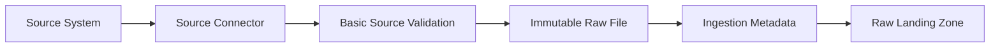

# Mercury Ingestion Framework

## Purpose

The ingestion framework defines how source data enters Mercury.

Its purpose is to provide a consistent, reusable pattern for extracting data from independent source systems and preserving it in the Raw Landing layer.

The framework separates source-specific extraction logic from shared platform capabilities such as configuration, logging, validation, metadata generation, and raw file storage.

---

## Design Goals

The ingestion framework should:

- support multiple independent source systems;
- preserve source data without transformation;
- use a consistent connector interface;
- produce structured ingestion metadata;
- support repeatable and idempotent execution;
- fail clearly and safely;
- remain simple enough to run locally;
- allow future deployment to cloud execution services;
- minimize source-specific code outside individual connectors.

---

## Scope

The initial implementation supports batch ingestion from local public datasets.

The framework will first ingest the Olist e-commerce dataset, with individual files representing separate Nova Commerce operational systems.

The initial version will not include:

- real-time streaming;
- change data capture;
- direct production API integrations;
- distributed processing;
- automatic schema evolution;
- enterprise secrets management.

These capabilities may be introduced later when justified by a concrete requirement.

---

## Source-System Model

Although the initial data originates from one public dataset, Mercury treats each business function as an independent operational source.

| Mercury Source | Reference Dataset |
|---|---|
| Commerce Platform | Orders and order items |
| Customer Platform | Customers |
| Product Catalogue | Products and category translation |
| Payment Platform | Order payments |
| Review Platform | Order reviews |
| Seller Platform | Sellers |
| Logistics Platform | Order delivery timestamps and geolocation |

Each source is ingested independently and receives its own configuration, execution metadata, and raw landing path.

---

## High-Level Flow



---

## Connector Responsibilities

Each source connector is responsible for:

1. locating or retrieving the source data;
2. confirming that the source is accessible;
3. performing basic structural validation;
4. preserving the source data in the Raw Landing layer;
5. collecting ingestion metadata;
6. returning a clear execution result;
7. raising meaningful errors when ingestion fails.

A connector must not:

- rename business fields;
- apply business rules;
- deduplicate records;
- enrich source data;
- join multiple sources;
- create canonical entities;
- calculate business metrics.

These restrictions preserve the boundary between ingestion and transformation.

---

## Shared Platform Responsibilities

Common ingestion capabilities should be implemented once and reused by every connector.

These include:

- configuration loading;
- raw landing path generation;
- structured logging;
- UTC timestamp generation;
- ingestion identifier generation;
- checksum calculation;
- metadata serialization;
- common exception handling;
- execution status reporting.

This separation keeps each connector focused on source-specific extraction while Mercury provides the surrounding platform behaviour.

---

## Proposed Repository Structure

```text
ingestion/
├── src/
│   └── mercury_ingestion/
│       ├── connectors/
│       │   ├── base.py
│       │   └── customers.py
│       ├── common/
│       │   ├── config.py
│       │   ├── exceptions.py
│       │   ├── logging.py
│       │   ├── metadata.py
│       │   └── storage.py
│       └── runner.py
├── tests/
├── pyproject.toml
└── README.md
```

---

## First Vertical Slice

The first implementation will ingest the customer dataset.

```mermaid
flowchart LR
    A[Olist Customer CSV] --> B[Customer Connector]
    B --> C[Structural Validation]
    C --> D[Immutable Local Raw File]
    B --> E[Ingestion Metadata]
    D --> F[Automated Verification]
    E --> F